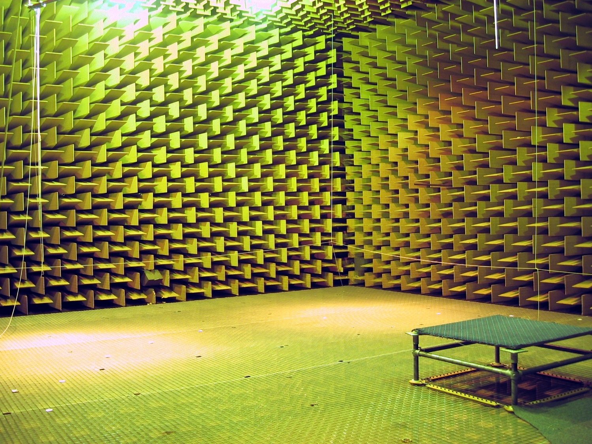
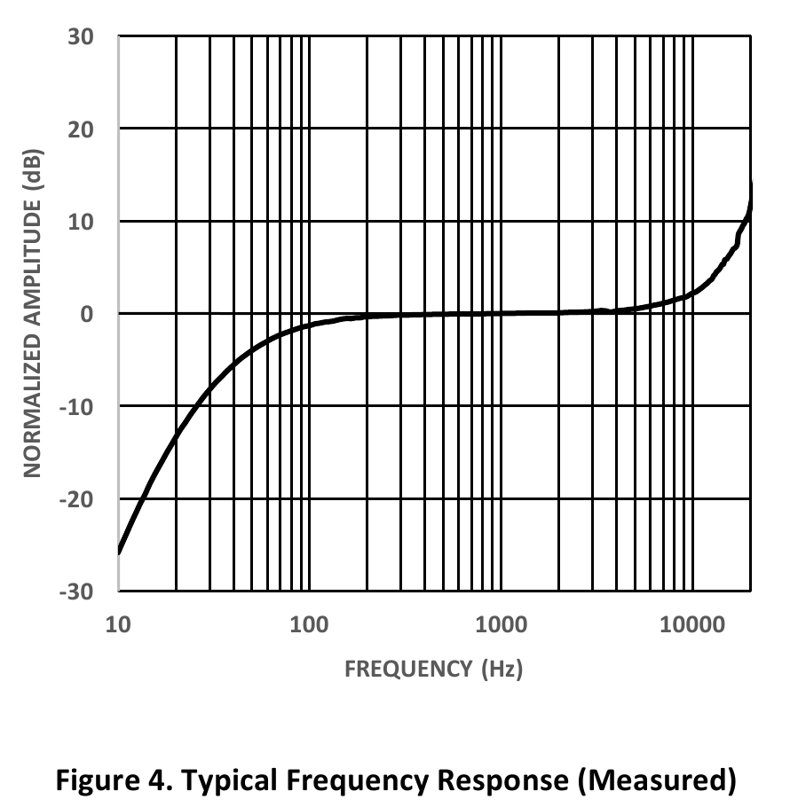

# Why measure noise?

- **Reasons**
  - Audience protection (DIN 15905-5): max. 99 dB(A) averaged over 30 min, peaks max. 135 dB(C)
  - Noise emissions at the neighbours (Freizeitlärm-Richtlinie): max. 70 dB(A) by day, 55 dB(A) at night
- **Existing systems**
  - Class 1 (precise, needed for official measurements) vs class 2 (less precise)
  - Handheld meters: class 2 ~€100–2,000, class 1 ~€3,000–4,500. Someone has to walk to the measurement point (often the nearest neighbour)
  - Monitoring stations with automatic logging: ~€5,000+ per measurement point
- **Our system**
  - Wouldn't hold up in court, but good enough for the local council and neighbours
  - Helps our sound engineers adjust the PA
  - Easy to deploy, no maintenance

# Basics

- Sound is a pressure wave in the air
- **Frequency** = how fast the air vibrates, in Hz (vibrations per second). Low = bass, high = treble. We hear roughly 20 Hz – 20 kHz
- **Sound level** is measured in decibels (dB), a logarithmic scale: +3 dB = twice the sound energy, +10 dB = 10× the energy (sounds about twice as loud)
- dB is always relative to a defined 0 point. We use **dB SPL**: 0 dB = 20 µPa, about the quietest sound we can hear at 1 kHz. Quieter sounds have negative values

<!-- source: illustrations/00-basics-frequency-and-level.tldr -->

*Anechoic chamber: every surface absorbs sound, so levels can drop below 0 dB (record: −25 dB). Photo: Arnaud Dessein, [CC BY-SA 3.0](https://creativecommons.org/licenses/by-sa/3.0), via [Wikimedia Commons](https://commons.wikimedia.org/wiki/File:Anechoic_chamber_DTU.jpg)*

# What is loudness?

- Our ears don't hear all frequencies as equally loud
- We're most sensitive around 2–5 kHz, and much less sensitive to deep bass and very high tones
- Example: a 50 Hz bass tone sounds ~30 dB quieter than a 1 kHz tone at the same sound pressure
- So to measure (subjective) loudness, we need to analyze which frequencies are in the sound
- **A-weighting** adjusts a measurement to match human hearing, shown as dB(A). Most noise regulations use it
- Loudness also depends on time: levels change constantly, so regulations judge the average over a time window (e.g. 30 minutes), called **Leq** (equivalent continuous sound level), plus a limit for short peaks

<!-- source: illustrations/00-a-weighting.tldr -->

# Hardware

- **Microcontroller:** ESP32-S3 (dual-core), 16 MB flash, 2 MB PSRAM
- **Connectivity:** Wi-Fi and Bluetooth built in
- **Microphone:** TDK InvenSense ICS-43434, digital MEMS mic (I²S, 24-bit)
- **Clock:** DS3231 real-time clock, so timestamps stay correct without internet
- **Power:** 18650 lithium-ion battery (about 30 h), or USB
- **Status:** RGB LED

# Measuring Noise Levels

## 1. From sound wave to samples

- The microphone samples the sound wave 48,000 times per second (48 kHz)
- Each sample is the wave's height at that moment, stored as a 24-bit number
- The samples go into a ring buffer in the ESP32's memory that always holds the last 4096 samples (~85 ms), long enough to tell bass frequencies apart, short enough to catch sudden loud sounds

<!-- source: illustrations/01-sound-to-samples.tldr (open in tldraw.com or the tldraw VS Code extension) -->

## 2. Analyzing short snippets

- We analyze the sound in short snippets of 4096 samples (~85 ms)
- **Problem: hard cuts.** Cutting a snippet out of the wave leaves sudden jumps at its edges. The analysis sees those jumps as frequencies that aren't in the sound.
- **Fix: Hann window.** Fade each snippet in and out with a smooth bell curve (0 at the edges, 1 in the middle), so there are no jumps.
- **Problem: fading loses sound.** Whatever happens near the edges of a snippet gets faded out.
- **Fix: 50% overlap.** Start a new snippet every 2048 samples (~43 ms). The faded edges of one snippet are the middle of the next, so every sample counts equally.

<!-- source: illustrations/02-snippets-hann-overlap.tldr -->

> **TODO:** explain the 2-core architecture (Core 1: audio reading + FFT worker, Core 0: storage, Wi-Fi/MQTT, Bluetooth)

## 3. FFT: from samples to frequencies

- The FFT (Fast Fourier Transform) is our black box: a snippet goes in, frequencies come out
- **In:** one snippet of 4096 samples (~85 ms)
- **Out:** 2048 frequency buckets, each 11.7 Hz wide, from 0 to 24 kHz
- Each bucket says how strongly its frequency was present in the snippet

<!-- source: illustrations/03-fft-buckets.tldr -->

## 4. Making the values usable: calibration, weighting and averaging over time

1. **Calibration:** a small correction per bucket adjusts for production differences between microphones (details in the calibration section)
2. **Weighting:** add the A- (or C-) weighting correction to each bucket, e.g. 1 kHz +0 dB, 50 Hz −30 dB
3. **Across frequencies:** combine all buckets into one dB(A) value per snippet (~23 per second)
4. **Decibel addition:** dB is logarithmic, so values can't simply be summed or averaged (two 80 dB speakers give 83 dB, not 160 dB). Instead, convert to normal numbers, combine, convert back:
   $$L = 10 \cdot \log_{10}\Big(\sum 10^{L_i/10}\Big)$$
5. **Over time:** the same formula, averaged instead of summed, gives the Leq over 1 s, 1 min, 5 min and 30 min. LAeq,5m = **L**evel, **A**-weighted, **eq**uivalent, over **5 m**inutes

## 5. Logging: getting the data off the device

- Finest resolution: send the raw audio. The server can compute anything, but it's ~144 KB/s (~12 GB per day per device)
- Coarsest resolution: send one value per minute. Tiny, but anything not computed on the device is lost for good (short peaks, bass, a different weighting)
- We send aggregated Leq values, A- and C-weighted, over different time windows (1 s, 1 min, 5 min, 30 min)
- Plus unweighted frequency bands, so other weightings can be applied later
- MQTT and Bluetooth: every second, fire and forget
- File logging: every minute, uploaded via HTTPS, kept on the device until the upload succeeds
- Longer periods (hour, day, whole event) are computed server-side from the 1-minute records, with the same Leq formula

<!-- source: illustrations/05-on-device-aggregation.tldr -->

# Calibration

<!-- source: TDK InvenSense ICS-43434 datasheet DS-000069 v1.2, Figure 4 (docs/datasheets/DS-000069-ICS-43434-v1.2.pdf) -->

- Put a calibrated measurement microphone (miniDSP UMIK-1, with its own calibration file) and the device side by side
- Play pink noise: random noise with equal energy in every octave, so all frequency bands get signal at the same time
- Read the frequency bands from both microphones and compare them band by band
- Skip the first 5 seconds while the level settles, then average 30 seconds per band (with the Leq formula)
- Save the per-band differences to the device via Bluetooth. It stores them and applies them to every measurement from then on

# Software

- Logs are stored in Postgres
- Live data in the browser: MQTT over WebSocket, or directly from the device via the Web Bluetooth API
- Calibration runs entirely in the browser:
  - Pink noise is generated live with the Web Audio API
  - The laptop's audio devices play the noise and capture the reference mic (getUserMedia)
  - Device values are read via Web Bluetooth, and the calibration is uploaded via Web Bluetooth
